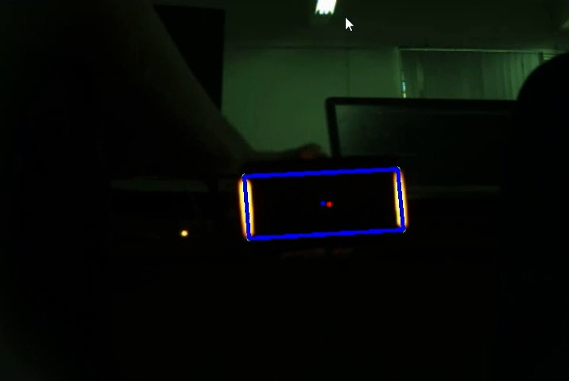

## 使用OPENCV识别视觉装甲板算法

#### 介绍

识别目标装甲板，按照要求筛除目标，对灯条进行匹配，然后用pnp解算出目标距离，基于距离给出提前量对目标的行动轨迹预测打击。

#### 参数设置

```c++
const short int minarea = 50;               //灯条的最小识别面积
const short int wid_hei = 3;                //灯条的最小高宽比
const short int maxarea = 1200;             //灯条的最大识别面积
const short int max_dist_x_ratio = 3;       //两个灯条X坐标与灯条高度的最大比值
const short int min_dist_x_ratio = 1;       //两个灯条X坐标与灯条高度的最小比值
const float parallel_tan = 0.3;             //两个灯条夹角的最大正切值
const short int mean_area_divisor = 3;      //两个灯条面积的差 < 两个灯条面积的和/mean_area_divisor
const short int bianry_threshold = 100;     //图像二值化的阈值
#define YELLOW                              //灯条的颜色  para: RED  YELLOW   BLUE
```

通过修改参数可以实现不同识别要求

#### **树莓派识别效果**


FPS在50帧以上

#### 识别流程

（1）读入摄像头信息，相机内参，设定好参数

（2）图像预处理，包括设置曝光获得二值图，二值化，膨胀，形态学闭运算

（3）查找轮廓，并进行过滤

（4）获得最小外接四边形的坐标，用于匹配

（5）按照两装甲板的距离，平行角度差限制，面积差匹配装甲板

（6）pnp获得距离

（7）根据距离解算预测点

（8）计算FPS、识别准确率

#### 环境

系统： ubuntu 18.04

 C/C++ 编译环境：

 make：GNU Make 4.1

 cmake：cmake version 3.22.0

opencv：OpenCV 4.5.5

#### 程序效果

对于演示视频可以达到99%以上的准确率。



#### 不足之处

程序效率可以进一步提升。对于实际应用场景，可以删除冗余功能换取帧数的提升。

